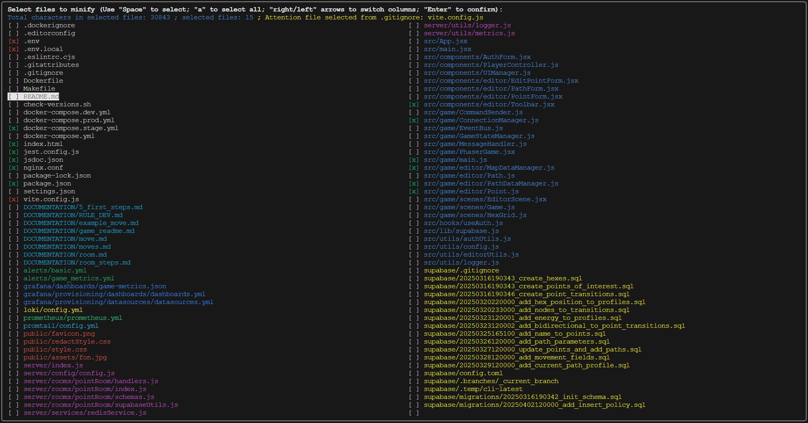

# Project Structure Parser & Minifier json

#### **Project Structure Parser & Minifier** is a library for creating your project's structure and preparing code for use in artificial intelligence chats by minifying json files. This library consists of two main scripts: `build-structure.js` and `minify-code.js`, which together provide a convenient process for parsing the project structure and working with its contents. Minification does not disrupt the code structure.  
---  


---

## What does the library do?

1. **Project structure scanning** (`build-structure.js`):
   - Allows you to choose one of two modes:
     - **Full scan**: parses the entire project from the root directory, excluding service folders (e.g., `node_modules`, `.git`, etc.).
     - **Selective scan**: analyzes only the files and directories you specify.
   - The result is saved in a minified JSON file `project-structure.min.json`, ideal for transmission to AI systems.

2. **Interactive file minification** (`minify-code.js`):
   - Uses the structure from `project-structure.min.json` to provide an interactive interface.
   - Allows you to select files for minification with color-coded directory display (configurable manually), consideration of files from `.gitignore`, and counting the total number of characters.
   - If a file listed in `.gitignore` is selected, a warning is displayed, and the selection is marked with a red cross. P.S.: This is done to prevent sending secrets like `.env` files to chats.
   - In the `project-code.min.json` file, the file's code begins with an indication of its relative path, so the chat won’t get confused about the structure (it’s enough to send just this file to the chat).
   - Saves the contents of selected files into a minified JSON file `project-code.min.json`, optimized for saving tokens in AI chats.
   - Supports saving and managing file selections (load/save/delete).

---

## Installation

1. Ensure you have Node.js version 16 or higher installed.
2. Install the library via npm:
   ```bash
   npm install project-minifier
   ```
3. Add scripts to your `package.json`:
   ```json
   "scripts": {
     "build-structure": "build-structure",
     "minify-code": "minify-code",
     "all-minifi": "npm run build-structure && npm run minify-code"
   }
   ```

---

## Configuration

The library is ready to use "out of the box," but you can easily customize it to suit your needs:

### 1. Configuring selective parsing (second mode in `build-structure.js`)
If you choose the "Scan only specified files and directories" mode (input `2`), the library parses only the files and directories you specify. The settings are located in the `main()` function in the `build-structure.js` file:

```javascript
const dirs = ['src', 'server', 'supabase/migrations']; // Specified directories
const files = ['package.json', 'redis.conf', 'README.md', 'game_readme.md']; // Specified files
```

- **Where to change**: Find these lines at the bottom of the `build-structure.js` file inside the `main()` function.
- **Tip**: Specify paths relative to the project root (where the script is run).

### 2. Configuring exclusions for full parsing (first mode in `build-structure.js`)
When selecting the "Scan all project files" mode (input `1`), the script parses the entire project, excluding specified directories. The list of exclusions is located in the `buildStructureJSON` function in the `build-structure.js` file:

```javascript
const excludedDirs = [
    'dist', '.github', '.cursor', '.vscode', 'node_modules', 
    '.git', 'docker', 'json-project', 'docs', 'logs'
];
```

- **Where to change**: Find the `excludedDirs` array inside the `buildStructureJSON` function.

---

## Usage

1. **Building the project structure**:
   ```bash
   npm run build-structure
   ```
   - Choose a mode:
     - `1` — full parsing with exclusions.
     - `2` — selective parsing of specified files and folders.
   - Result: `json-project/project-structure.min.json`.

2. **File minification**:
   ```bash
   npm run minify-code
   ```
   - Choose an action:
     - **Select files to minify**: interactive file selection with character counting.
     - **Load a saved selection**: load a previously saved selection.
     - **Manage saved selections**: manage selections (delete).
     - **Exit**: exit.
   - Use `Space` to select, `left`/`right` to switch columns, `Enter` to confirm.
   - Result: `json-project/project-code.min.json`.

---

## Why use it?

- **Flexibility**: Configurable parameters.
- **Interactivity**: Convenient CLI interface with visual feedback.
- **AI preparation**: Structured JSON and code minification for AI chats.
- **Efficiency**: Data optimization for saving space and tokens.
- **Speed**: Works quickly and doesn’t require many resources.
- **File selection**: You can choose only the necessary files and folders.
- **Selection management**: You can save (automatically creates a folder for saves), load, and delete selections.

---

Configure the library for your tasks and simplify code preparation for AI chats.